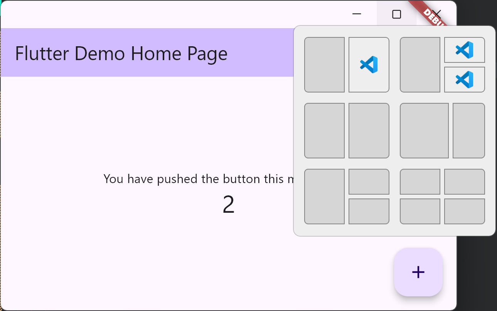

### 在 Flutter 中实现 Windows11 的 Snap Layouts 示例

#### 实现效果如下：



#### 实现流程

1. 接入 [window_manager](https://github.com/leanflutter/window_manager) 库, 隐藏标题栏, 并自定义标题栏

```
// main.dart

Future<void> main() async {
  await startupWindow();
  runApp(const MyApp());
}

Future<void> startupWindow() async {
  WidgetsFlutterBinding.ensureInitialized();
  if (Platform.isWindows || Platform.isLinux || Platform.isMacOS) {
    const windowSize = Size(1000, 600);
    const minSize = Size(300, 100);
    await windowManager.ensureInitialized();
    WindowManager.instance.setMinimumSize(minSize);
    WindowOptions windowOptions = WindowOptions(
      size: windowSize,
      center: true,
      backgroundColor: Colors.transparent,
      skipTaskbar: false,
      // hide system title bar
      titleBarStyle: TitleBarStyle.hidden,
      windowButtonVisibility: Platform.isMacOS,
    );
    windowManager.waitUntilReadyToShow(windowOptions, () async {
      await windowManager.show();
      await windowManager.focus();
    });
  }
}

...

// app.dart

Widget buildAppBarDesktop(ColorScheme colorScheme) {
  final brightness = colorScheme.brightness;
  final backgroundColor = colorScheme.surface;
  final isDesktop =
      Platform.isWindows || Platform.isLinux || Platform.isMacOS;
  return SizedBox(
    height: isDesktop ? kWindowCaptionHeight : 0,
    child: WindowCaption(
      backgroundColor: backgroundColor,
      brightness: brightness,
      isFullScreen: false,
    ),
  );
}

```

2. 引入 WindowsInterface 插件

```
// windows/runner/CMakeLists.txt 中添加

# add windows_interface
add_subdirectory("windows_interface")

# link windows_interface
target_link_libraries(${BINARY_NAME} PRIVATE windows_interface)
```

```
// windows/runner/flutter_window.cpp 中添加

#include "windows_interface.h"

bool FlutterWindow::OnCreate() {
  ...
  WindowsInterface::RegisterPlugin(flutter_controller_->engine(), flutter_controller_->view()->GetNativeWindow());
  ...
}
```

3. 具体 windows_interface 插件实现

```
// C++ 端处理 HTMAXBUTTON 相关事件
windows/runner/windows_interface/*

// 修复原 window_manager 插件中的问题：
// 1. 双击标题栏按下时最大化
// 2. 从C++端接收鼠标事件, 因为实现了HTMAXBUTTON后, Flutter侧的鼠标事件丢失
lib/src/widgets/window/*

// dart侧的api实现
lib/src/platform/windows/windows_interface.dart
```

4. 接入新的标题栏

```
// app.dart

// 使用 FixWindowCaption 替代 WindowCaption
Widget buildAppBarDesktop(ColorScheme colorScheme) {
  final brightness = colorScheme.brightness;
  final backgroundColor = colorScheme.surface;
  final isDesktop =
      Platform.isWindows || Platform.isLinux || Platform.isMacOS;
  return SizedBox(
    height: isDesktop ? windowCaptionHeight : 0,
    child: FixWindowCaption(
      backgroundColor: backgroundColor,
      brightness: brightness,
      isFullScreen: false,
    ),
  );
}

```

#### 实现细节

```
// 接管了 Flutter 侧的 Client 区域的 HWND 的 WndProc 事件
// 让其在右上角三个 Button 处返回其该有的 HTMAXBUTTON、HTMINBUTTON、HTCLOSE
case WM_NCHITTEST:
{
  if (titleBarHoveredButton == CustomTitleBarHoveredButton_Maximize) {
    return HTMAXBUTTON;
  } else if (titleBarHoveredButton == CustomTitleBarHoveredButton_Minimize) {
    return HTMINBUTTON;
  } else if (titleBarHoveredButton == CustomTitleBarHoveredButton_Close) {
    return HTCLOSE;
  }
  return HTCLIENT;
  break;
}

// 然后在C++侧处理 Move、Down、和 Up 事件, 发送回 Dart 端的 Button 做处理
case WM_NCMOUSEMOVE: {
  UpdateTitleButtonStatus(hWnd);
  break;
}
case WM_MOUSEMOVE: {
  UpdateTitleButtonStatus(hWnd);
  break;
}
case WM_NCLBUTTONDOWN: {
  if (titleBarHoveredButton != CustomTitleBarHoveredButton_None) {
    OnTitleButtonDown();
    titleBarDownButton = titleBarHoveredButton;
    return HTNOWHERE;
  }
  break;
}
case WM_NCLBUTTONUP:
{
  if (titleBarHoveredButton != CustomTitleBarHoveredButton_None) {
    OnTitleButtonUp();
    if (titleBarHoveredButton == titleBarDownButton) {
      OnTitleButtonClick();
    }
    titleBarDownButton = CustomTitleBarHoveredButton_None;
  }
  break;
}

// Button 的区域根据 Dart 侧传递的 TitleHeight 和 TitleButtonWidth 确定
void WindowsInterface::SetWindowsTitleHeight(int64_t height) {
  windowsTitleHeight = static_cast<int32_t>(height);
}
void WindowsInterface::SetWindowsTitleButtonWidth(int64_t width) {
  windowsTitleButtonWidth = static_cast<int32_t>(width);
}

```
